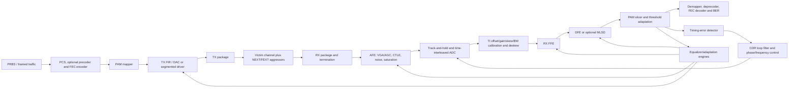

# Long-Range ADC-Based SerDes Modeling: Literature Review and Recommended Framework

**Research date:** 2026-08-29  
**Primary scope:** electrical copper backplane/cable links, 56–224 Gb/s per lane, primarily PAM4  
**Purpose:** define an executable modeling framework that predicts architecture-level performance and can later be refined into implementation-accurate DSP/RTL models

## Executive recommendation

Build one model with four fidelity modes sharing the same block APIs and configuration:

1. **COM-like channel screening** for fast feasibility and standards correlation.
2. **Pulse-response/statistical analysis** for rapid sweeps and low-BER extrapolation.
3. **Sampled time-domain simulation** for adaptation, clock recovery, ADC nonidealities, nonlinearities, error bursts, and convergence.
4. **Fixed-point/vectorized emulation** for datapath width, hardware timing, power proxies, and RTL correlation.

The recommended first target is a configurable **112-Gb/s PAM4, 56-GBd, baud-rate ADC receiver** with a 2-sample/UI high-resolution “truth” mode. Use a 5-tap TX FIR, programmable CTLE/VGA, 6–7-bit time-interleaved ADC, 21–32-tap RX FFE, 1–3-tap DFE, and Mueller–Muller (M&M) baud-rate CDR. Add 212.5/224-Gb/s operation only after the 112-Gb/s model is correlated.

This architecture is consistent with the direction of the literature. The seminal 12.5-Gb/s ADC SerDes used a baud-rate ADC, digital 2-tap FFE, 5-tap DFE, and M&M CDR [Harwood et al., 2007](https://people.engr.tamu.edu/spalermo/ecen689/12p5Gbps_serdes_adc_harwood_isscc_2007.pdf). A later 112-Gb/s long-reach receiver used a resonant AFE, 64-way time-interleaved ADC, 16-tap FFE, 1-tap DFE, and digital CDR while operating over approximately 35-dB-loss-at-Nyquist channels [Krupnik et al., 2020](https://doi.org/10.1109/JSSC.2019.2959511). A 224-Gb/s design demonstrated that a strong hybrid AFE can reduce the converter requirement to 6 bits while supporting long-reach channels [Khairi et al., 2023](https://doi.org/10.1109/JSSC.2022.3211475).

The essential modeling conclusion is therefore:

> Treat the AFE, sampling clock, ADC, equalizer, adaptation, CDR, and FEC-facing error process as a coupled system. A channel-only eye or an ideal floating-point FFE/DFE is not an adequate long-range ADC SerDes model.

## 1. Scope and standards context

“Long range” is ambiguous across standards. This report uses it to mean high-loss electrical backplane or copper-cable links rather than long-haul optical SerDes.

- OIF CEI-112G-LR defines 36–58 GBd PAM4 operation over as much as 1000 mm of PCB and up to two connectors. OIF CEI 5.x also distinguishes XSR, MR, and LR rather than using one universal loss target [OIF CEI implementation agreements](https://www.oiforum.com/technical-work/implementation-agreements-ias/).
- OIF’s 224G-LR project targets 144–232 Gb/s signaling over up to 1000 mm of backplane and up to two connectors; the public OIF page still presents it as a project, so its values should not be hard-coded as a finished interoperability agreement [OIF CEI-224G project page](https://www.oiforum.com/technical-work/hot-topics/common-electrical-i-o-cei-224g/).
- The OIF 224G framework identifies ADC/DSP receivers, multi-tap FFE plus DFE, MLSE, and joint DSP/FEC design as important techniques for lossy links [OIF CEI-224G framework](https://www.oiforum.com/wp-content/uploads/OIF-FD-CEI-224G-01.0.pdf).
- IEEE Channel Operating Margin (COM) is a standards-oriented reference-receiver analysis, not a transistor- or architecture-accurate receiver. IEEE now maintains the latest COM code through an open-source project; older 4.x releases remain archived [IEEE 802.3 COM project](https://www.ieee802.org/3/ad_hoc/COM/public/index.html).

For this reason, all rate, reach, loss, jitter, FEC, and target error-ratio values should live in versioned configuration files. The model should support at least these profiles:

| Profile | Nominal modulation/rate | Main purpose |
|---|---:|---|
| Research baseline | PAM4, 56 GBd / 112 Gb/s | Algorithm development and published-silicon correlation |
| CEI-112G-LR-like | PAM4, configurable 36–58 GBd | 112G link and channel studies |
| IEEE 200G/lane-like | PAM4, 106.25 GBd / 212.5 Gb/s | COM and 802.3dj channel studies |
| OIF 224G-LR research | PAM4, configurable 72–116 GBd | Future long-reach architecture exploration |

The profile name must identify the exact source revision. “112G” or “224G” alone is not a reproducible specification.

## 2. What the literature establishes

### 2.1 Architecture evolution

| Work | Receiver architecture or result | Modeling lesson |
|---|---|---|
| [Harwood et al., ISSCC 2007](https://people.engr.tamu.edu/spalermo/ecen689/12p5Gbps_serdes_adc_harwood_isscc_2007.pdf) | Baud-rate 4.5-bit flash ADC, digital 2-tap FFE, 5-tap DFE, M&M CDR | Baud-rate ADC/DSP SerDes is an established architecture; equalization and timing recovery are coupled. |
| [Chen, Yousry, and Yang, JSSC 2012](https://doi.org/10.1109/JSSC.2012.2185356) | Mixed-mode pre-equalization plus nonuniform ADC references | ADC resolution should be optimized against BER and channel behavior, not only standalone SNDR. |
| [Zhian Tabasy et al., JSSC 2014](https://people.engr.tamu.edu/spalermo/docs/2014_10G_ADC_embed_eq_zhiantabasy_jssc.pdf) | 64-way 6-bit 10-GS/s TI-SAR with embedded 2-tap FFE and 1-tap DFE | Analog/embedded equalization can trade against ADC range and digital complexity. |
| [Kiran et al., TCPMT 2019](https://doi.org/10.1109/TCPMT.2018.2853080) and [Kiran dissertation](https://oaktrust.library.tamu.edu/items/34c46e76-7ce5-444e-81ba-696e2ab4ac6c) | Hybrid statistical ADC receiver model including quantization, INL/DNL, and time-interleaver mismatch | Quantization and TI-ADC errors need explicit models; treating all ADC error as independent Gaussian noise can be misleading. |
| [Krupnik et al., JSSC 2020](https://doi.org/10.1109/JSSC.2019.2959511) | 112-Gb/s PAM4, resonant AFE, 64-way TI ADC, 16-tap FFE, 1-tap DFE, digital CDR | Strong AFE plus moderate digital equalization is practical for about 35-dB Nyquist loss. |
| [Khairi et al., JSSC 2023](https://doi.org/10.1109/JSSC.2022.3211475) | 224-Gb/s PAM4, hybrid AFE, 6-bit interleaved ADC, digital equalizer | At 224G, AFE/ADC/clock co-design is central; brute-force ADC resolution is not the preferred solution. |
| [Yadav, Hsieh, and Carusone, OJCAS 2022](https://doi.org/10.1109/OJCAS.2022.3211844) | Linear and signed M&M loop models for ADC-based PAM4 | CDR performance depends on equalization in the timing path, phase-detector gain-to-noise ratio, and loop latency. |
| [Jang et al., OJ-SSCS 2024](https://research.ibm.com/publications/recent-advances-in-ultra-high-speed-wireline-receivers-with-adc-dsp-based-equalizers) | Review of modern DAC/ADC-DSP datapaths and hardware emulation | The model should progress from software architecture to parallel hardware datapath and real-time emulation. |
| [Lee et al., TCAS-II 2024](https://research.ibm.com/publications/a-dacadc-based-wireline-transceiver-datapath-functional-verification-on-rfsoc-platform) | RFSoC realization of equalization and adaptation, with RTL reuse | FPGA/RFSoC is a useful bridge between floating-point simulation and silicon-ready RTL. |

Two themes are consistent across these works:

1. **Hybrid equalization is power-efficient.** The CTLE/VGA reduces the dynamic range and bandwidth burden seen by the ADC; the DSP removes residual and reflection-induced ISI.
2. **BER depends on structured impairments.** Quantization, time-interleaving spurs, DFE feedback, and clock error are signal-dependent and cannot always be collapsed into one RMS-noise number.

### 2.2 Modern standards reference receivers are becoming more DSP-like

IEEE 802.3dj studies for 212.5-Gb/s PAM4 have used a reference receiver with CTLE, six precursor and 24 postcursor fixed FFE taps, groups of floating DFE taps reaching to 60 UI, and a one-memory MLSD/MLSE term. One public 40-dB bump-to-bump channel study reported COM of 4.75 dB at detector error ratio $10^{-4}$ with that configuration [IEEE 802.3dj contribution](https://www.ieee802.org/3/dj/public/23_09/lim_3dj_04_2309.pdf). These are reference-model capabilities, not a claim that every product implements this exact filter.

This matters because a short contiguous FFE/DFE can equalize smooth loss but struggle with delayed reflections. The framework should therefore support **sparse or floating taps** and optional short-memory MLSD without forcing them into the first baseline.

## 3. Recommended modeling hierarchy

| Level | Engine | Captures | Does not reliably capture | Typical use |
|---|---|---|---|---|
| L0 | Frequency-domain/link budget | Insertion loss, return loss, crosstalk spectra, package/board cascade | Adaptation, clipping, timing loops, symbol-dependent errors | Channel triage |
| L1 | COM-like statistical reference | Reference CTLE/FFE/DFE, noise, jitter, crosstalk, standards margin | Actual ADC transfer curve, convergence, nonlinear loops, error bursts | Standards correlation and broad sweeps |
| L2 | Pulse-response statistical BER | Full pulse response, residual ISI distributions, quantizer bins, analytic noise convolution | Strong nonlinear memory and loop acquisition | Architecture sweeps and rare-error estimates |
| L3 | Floating sampled time domain | ADC codes, jitter, TI mismatch, adaptation, CDR, nonlinear AFE, DFE propagation | Gate timing, finite word length, physical power | Algorithm development and golden model |
| L4 | Fixed-point/vectorized | Parallel lanes, saturation, rounding, coefficient update rate, latency | Place-and-route parasitics unless added | RTL specification and hardware cost |
| L5 | FPGA/RFSoC/IBIS-AMI correlation | Real-time datapath, external channel, interoperability | Final analog front-end fidelity unless calibrated | Pre-silicon functional validation |

The L1 and L3 engines should be developed first. L1 quickly answers “is this channel plausible?” L3 answers “will this receiver actually acquire and operate?” L2 is then valuable for reaching error probabilities far below practical Monte Carlo depth.

COM itself defines margin as a signal-to-interference-and-noise ratio in the context of a specified reference architecture; an introductory IEEE tutorial writes it as $20\log_{10}(A_s/N)$ [IEEE COM tutorial](https://www.ieee802.org/3/cb/public/mar16/mellitz_3cb_01_0316.pdf). It should be a correlation target, not the only signoff result.

## 4. Proposed end-to-end block diagram



**Fig. 1 — Recommended long-range ADC-based SerDes model.** Feedback paths are first-class model elements rather than post-processing.

The receiver should expose both a **data path** and a **timing path**. They may share the FFE initially, but separate coefficients must be possible because the FFE that minimizes data MSE does not necessarily maximize M&M phase-detector gain-to-noise ratio.

## 5. Mathematical core

### 5.1 Waveform and channel

For PAM symbols $a_k \in \{-3,-1,+1,+3\}$ after normalization, the linear received waveform before AFE nonlinearity is

\[
r(t)=\sum_k a_k p(t-kT)+\sum_{q=1}^{N_X}\sum_k a_{q,k}p_q(t-kT-\tau_q)+n(t).
\tag{Eq. 1}
\]

Here $p(t)$ is the victim pulse response including TX FIR, packages, channel, and linear AFE; $p_q(t)$ is each aggressor response; $T$ is the UI; and $n(t)$ includes receiver and coupled noise. Keeping each aggressor distinct permits correlated aggressor patterns and phase offsets.

The TX FIR output is

\[
x_k=\operatorname{clip}\!\left(\sum_{i=-N_{pre}}^{N_{post}} c_i a_{k-i}, -x_{max}, x_{max}\right),
\tag{Eq. 2}
\]

with constraints on total driver current/swing and coefficient granularity. A model that renormalizes every coefficient vector to the same final amplitude can hide the real TX equalization penalty.

### 5.2 Time-interleaved ADC

For interleave phase $m=n\bmod M$, use

\[
y[n]=Q_m\left((1+g_m)\,[h_m*r]\!\left(nT_s+\tau_m+\phi[n]\right)+o_m+n_m[n]\right),
\tag{Eq. 3}
\]

where $g_m,o_m,\tau_m,h_m$ model gain, offset, sampling skew, and bandwidth mismatch; $\phi[n]$ contains deterministic and random clock error; and $Q_m(\cdot)$ is the actual quantizer transfer characteristic including saturation and optional INL/DNL. These four TI mismatch classes are explicitly identified in the ADC receiver modeling literature [Kiran dissertation](https://oaktrust.library.tamu.edu/items/34c46e76-7ce5-444e-81ba-696e2ab4ac6c).

Do not begin by replacing $Q(\cdot)$ with white noise of variance $\Delta^2/12$. That approximation is useful for a high-resolution sanity check, but deterministic quantization is required when there are only 5–7 bits, strong residual ISI, nonuniform thresholds, clipping, or adaptation based on ADC codes.

### 5.3 FFE, DFE, and slicing

The RX FFE is

\[
u_k=\sum_{i=-N_p}^{N_c} w_i y_{k-i}.
\tag{Eq. 4}
\]

The DFE output and PAM4 decision are

\[
z_k=u_k-\sum_{j=1}^{N_b} b_j\hat a_{k-j}, \qquad
\hat a_k=\mathcal{S}(z_k;\theta_1,\theta_2,\theta_3).
\tag{Eq. 5}
\]

Use a linear-MMSE or constrained-MMSE solution to initialize $w_i,b_j$, then adapt. Zero forcing is a useful diagnostic but is not the preferred baseline because it can strongly enhance noise and crosstalk.

For training or decision-directed normalized LMS,

\[
\mathbf{w}_{k+1}=\mathbf{w}_k+\mu\,
\frac{e_k\mathbf{y}_k}{\epsilon+\|\mathbf{y}_k\|^2},
\qquad e_k=d_k-z_k.
\tag{Eq. 6}
\]

Hardware-oriented modes should also include sign-error LMS and sign-sign LMS. They reduce multiplier cost but change convergence, limit cycles, and steady-state misadjustment.

### 5.4 Baud-rate timing recovery

A decision-directed linear M&M timing error can be represented as

\[
e^{MM}_k=\hat a_{k-1}z_k-\hat a_k z_{k-1}.
\tag{Eq. 7}
\]

The exact PAM4 detector should be selectable between linear, signed, and implementation-specific forms. Use a second-order loop with phase and frequency states:

\[
f_{k+1}=f_k+K_i e_k,\qquad
\phi_{k+1}=\phi_k+f_{k+1}+K_p e_k.
\tag{Eq. 8}
\]

Model phase-detector latency, decimation/update rate, phase-interpolator quantization, oscillator phase noise, spread-spectrum clocking if applicable, and frequency offset in ppm. The M&M literature shows that equalization and loop latency materially change timing-loop gain and jitter tolerance [Yadav et al., 2022](https://doi.org/10.1109/OJCAS.2022.3211844).

### 5.5 Error metrics

Report at least:

\[
\mathrm{SER}=\frac{N_{sym,err}}{N_{sym}},\qquad
\mathrm{BER}=\frac{N_{bit,err}}{N_{bit}},\qquad
\mathrm{COM}=20\log_{10}\left(\frac{A_s}{N}\right).
\tag{Eq. 9}
\]

For FEC-facing analysis also report the error-event rate, burst-length complementary CDF, errors per FEC codeword, uncorrectable-codeword rate, and frame-loss estimate. Raw BER alone is insufficient because a DFE can turn one wrong decision into a correlated burst. IEEE studies explicitly identify more severe DFE error propagation for PAM4 and analyze precoding/FEC interaction [IEEE P802.3ck contribution](https://www.ieee802.org/3/ck/public/18_09/zhang_3ck_01a_0918.pdf).

## 6. Equalization and adaptation algorithms

### 6.1 Recommended baseline sequence

1. **Characterize the linear channel.** Convert differential S-parameters, cascade TX/RX packages, verify passivity/causality, construct impulse and pulse responses, and locate precursor/postcursor/reflection energy.
2. **Search discrete AFE and TX settings.** Sweep legal TX FIR and CTLE/VGA codes. Reject settings that clip the driver, AFE, or ADC.
3. **Initialize RX coefficients with constrained LMMSE.** Include the noise covariance and impose main-cursor, tap-magnitude, and coefficient-resolution constraints.
4. **Acquire with a training sequence.** Adapt gain, PAM thresholds, ADC interleave calibration, FFE, DFE, and timing using deliberately separated bandwidths.
5. **Switch to decision-directed tracking.** Reduce step sizes, freeze slow loops when appropriate, and retain frequency/timing tracking.
6. **Run payload plus FEC-facing statistics.** Preserve the temporal order of errors.

### 6.2 Algorithm choices by block

| Block | First implementation | Add later | Important failure mode |
|---|---|---|---|
| TX FIR | Grid search or constrained least squares | Backchannel adaptation, sign-sign LMS | Artificial amplitude renormalization hides swing loss |
| CTLE/VGA | Discrete code sweep using transfer functions | Nonlinear transistor/macromodel lookup | Noise enhancement, saturation, PVT code dependence |
| ADC range/thresholds | AGC plus uniform 6–7-bit quantizer | Nonuniform BER-optimal thresholds, INL/DNL tables | Clipping and signal-correlated quantization |
| TI calibration | Per-phase mean/variance; gradient timing deskew | Background correlation/calibration loops | Calibration loops absorb channel/data asymmetry |
| RX FFE | Constrained LMMSE, then NLMS | Sparse/floating taps, sign-sign LMS | Noise/crosstalk enhancement and coefficient quantization |
| DFE | 1–3 taps, LMS/NLMS | Loop-unrolled/look-ahead/loop-break hardware forms | Error propagation and critical feedback timing |
| PAM thresholds | Running cluster centroids or error-driven LMS | Per-phase or asymmetry-aware thresholds | Threshold loop fights DFE/AGC |
| CDR | M&M at 1 sample/UI | Gardner at 2 samples/UI for acquisition; separate timing FFE | False lock, latency, low detector gain, PI granularity |
| Reflection equalization | Contiguous FFE initially | Floating taps or sparse LMS | A long reflection consumes many contiguous taps |
| Sequence detection | Disabled initially | 1–2-memory MLSD/MLSE | State complexity, latency, implementation penalty |
| Crosstalk | Independent aggressor convolution | MIMO FFE/DFE and joint adaptation | Treating colored FEXT as white Gaussian noise |

The feedback-timing problem in a parallel DSP must not be postponed until RTL. Modern work proposes loop-break DFE structures that are functionally equivalent to conventional DFE while relaxing timing and reducing area relative to large look-ahead implementations [Kim et al., 2024](https://research.ibm.com/publications/a-loop-break-decision-feedback-equalizer-for-dacadc-dsp-based-wireline-transceivers).

For multiple strongly coupled lanes, a MIMO option is justified. A published RFSoC study used a 15-tap MIMO FFE plus one-tap MIMO DFE with LMS adaptation for PAM4 FEXT cancellation [IBM MIMO transceiver study](https://research.ibm.com/publications/a-2-lane-dac-adc-based-2-2-mimo-pam-4-mmse-dfe-wireline-transceiver-with-fext-cancellation-on-rfsoc-platform). It should remain optional because its datapath cost is much higher than independent-lane equalization.

## 7. Channel and impairment modeling requirements

### 7.1 S-parameter handling

The channel loader should:

- Read Touchstone S4P/S8P/etc. data and retain port-order metadata.
- Convert single-ended networks to mixed mode and use the differential transfer $S_{dd21}$, while preserving mode conversion for diagnostics.
- Renormalize impedances only when explicitly requested.
- Cascade die/package, breakout, PCB, connector, cable, and receiver package blocks.
- Interpolate complex data on a uniform frequency grid; preserve phase and delay.
- Check passivity, causality, reciprocity where expected, and frequency coverage.
- Apply a documented DC extrapolation and high-frequency roll-off rather than silently padding zeros.
- Produce impulse, step, and symbol pulse responses with time-zero and delay conventions under test.

The open-source Python stack can use NumPy/SciPy for signal processing and scikit-rf for Touchstone/network manipulation. scikit-rf documents Touchstone N-port handling [scikit-rf documentation](https://scikit-rf.readthedocs.io/_/downloads/en/latest/pdf/). PyBERT is a useful open-source reference for a Python SerDes simulator, but the proposed model needs deeper ADC/CDR/fixed-point coverage [PyBERT](https://github.com/capn-freako/pybert).

### 7.2 Required impairments

| Domain | Required in baseline | Research extensions |
|---|---|---|
| TX | FIR coefficient limits, finite rise/fall, swing/noise, RJ/DJ, DCD | Driver nonlinearity, supply modulation, PN skew |
| Channel | IL/RL, packages/connectors/vias, reflections, multiple NEXT/FEXT paths | Temperature/material variation, mode conversion |
| AFE | CTLE/VGA frequency response, input-referred noise, bandwidth, clipping | Volterra/table nonlinearity, offset, supply coupling |
| Clock | RJ, sinusoidal jitter, frequency offset, PI quantization | PLL/CDR phase-noise spectra, SSC, correlated supply jitter |
| ADC | Bits, range, clipping, aperture jitter, TI gain/offset/skew/BW mismatch | INL/DNL lookup, metastability, nonuniform thresholds |
| DSP | Tap limits, adaptation noise, latency, coefficient quantization | RTL scheduling, clock gating, power activity |
| PCS/FEC | Gray mapping, precoding option, error bursts/codeword mapping | Full soft-decision decoder and backchannel training |

ADC metastability can be added after the core model. Statistical work shows that comparator metastability can propagate through a digital FFE and should be modeled as code-dependent events rather than generic AWGN [Cai et al., 2014](https://people.engr.tamu.edu/spalermo/docs/2014_statistical_modeling_metastability_adc_based_rx_cai_epeps.pdf).

## 8. BER strategy and statistical confidence

Brute-force simulation cannot directly validate post-FEC error rates near $10^{-12}$–$10^{-15}$ in a practical architecture sweep. Use three complementary methods:

1. **Time-domain Monte Carlo** for acquisition, tracking, error correlation, and measured raw BER/SER where enough errors occur.
2. **Pulse-response statistical analysis** that enumerates dominant ISI symbols and convolves residual interference with random-noise, jitter, and quantizer distributions.
3. **Rare-event methods** such as importance sampling or conditional error simulation for selected final configurations.

Each reported BER must include the simulated bit count, error count, random seed, confidence interval or upper bound, warm-up interval, and whether coefficients were trained on the same data. “Zero errors” is not a BER measurement; with $N$ error-free independent bits, the approximate 95% upper bound is $3/N$.

For adaptive/DFE links, preserve the full error timeline. Do not randomly reshuffle errors before applying the FEC model.

## 9. Software implementation method

### 9.1 Recommended technology choice

Use **Python as the golden research model** unless an existing MATLAB license and corporate flow make Simulink/SerDes Toolbox the required environment.

Python advantages:

- Transparent algorithms and deterministic tests.
- Straightforward S-parameter, array, optimization, plotting, and HDF5 workflows.
- Easy transition from floating point to explicit integer/fixed-point classes.
- CI-friendly parameter sweeps without proprietary runtime dependencies.

MATLAB/Simulink remains a strong correlation and rapid-prototyping option. MathWorks provides an architectural 112G PAM4 ADC SerDes example with a TI ADC, demux, 21-tap FFE, one-tap DFE, and M&M phase detector [MathWorks 112G ADC model](https://www.mathworks.com/help/serdes/ug/architectural-112g-pam4-adc-based-serdes-model.html). Its CDR example also emphasizes that DFE and CDR loops are coupled [MathWorks clock-recovery model](https://www.mathworks.com/help/serdes/ug/model-clock-recovery-loops.html).

### 9.2 Proposed repository structure

```text
Serdes_Model/
├── pyproject.toml
├── README.md
├── configs/
│   ├── research_112g_pam4.yaml
│   ├── cei112_lr_like.yaml
│   └── ieee_212g5_pam4_like.yaml
├── src/serdes_model/
│   ├── stimulus.py
│   ├── tx.py
│   ├── channel.py
│   ├── afe.py
│   ├── adc.py
│   ├── cdr.py
│   ├── fec.py
│   ├── metrics.py
│   ├── statistical.py
│   ├── fixed_point.py
│   └── equalization/
│       ├── ffe.py
│       ├── dfe.py
│       ├── adaptation.py
│       └── mlsd.py
├── tests/
│   ├── unit/
│   ├── golden_vectors/
│   └── correlation/
├── channels/
│   ├── README.md
│   └── metadata.yaml
└── runs/
    └── <timestamped immutable outputs>/
```

Each processing block should have a streaming interface plus an impulse/statistical interface where meaningful. A run should save the fully resolved configuration, git revision, source-file checksums, seeds, coefficient histories, and metrics.

### 9.3 Numerical implementation principles

- Use a high-rate continuous-time-equivalent grid, initially 32–64 samples/UI, only for TX/channel/AFE truth generation.
- Resample at the exact ADC clock edge; do not snap jittered edges to the waveform grid.
- Keep the architecture path at 1 sample/UI and a truth/acquisition path at 2 samples/UI.
- Use chunked overlap-save convolution for long records and long channel impulse responses.
- Represent parallel hardware as arrays shaped `[time_frame, interleave_or_lane]`, not only as a scalar serial loop.
- Separate sample precision, coefficient precision, accumulator precision, rounding, and saturation rules.
- Make loop delays explicit integer parameters.
- Use stable, independent random streams for data, TX jitter, RX jitter, noise, and aggressors.

### 9.4 IBIS-AMI and hardware handoff

IBIS-AMI separates the linear analog channel from algorithmic TX/RX processing and permits receiver models to include waveform processing and clock recovery [IBIS 8.0 specification](https://ibis.org/ver8.0/ver8_0.pdf). An AMI wrapper is valuable after the Python/RTL behavior is stable, but it should not be the first implementation because compiled vendor models can obscure internal states needed during architecture development.

The practical handoff sequence is:

1. Floating-point Python golden vectors.
2. Vectorized finite-precision Python model.
3. C/C++ or synthesizable SystemVerilog datapath with bit-exact comparison.
4. FPGA/RFSoC emulation using slowed parallel processing.
5. IBIS-AMI packaging for system-level interoperability.

## 10. Validation and correlation plan

| Milestone | Test | Pass criterion |
|---|---|---|
| M1: primitives | FIR, quantizer, slicer, fractional delay, S-parameter conversion | Analytic/golden-vector agreement within stated tolerance |
| M2: ideal channel | PAM4 over AWGN and known FIR channel | BER agrees with analytic result; LMMSE coefficients match reference solve |
| M3: statistical/time-domain | Same fixed coefficients and impairments | Eye/PDF and BER agree within Monte Carlo confidence |
| M4: historical ADC link | Recreate the Harwood-style 12.5-Gb/s block ordering | Qualitative tap/CDR behavior and published architecture reproduced |
| M5: 112G architecture | 64-way TI ADC, 16–32 FFE taps, 1 DFE tap, M&M CDR | Stable acquisition and plausible sensitivity over a 29–35-dB Nyquist-loss channel |
| M6: COM | Run public IEEE channel/configuration pairs | Match the selected COM release within a predeclared numerical tolerance |
| M7: fixed point | Compare float and quantized datapaths | No unexpected BER floor; bounded coefficient/threshold deviations |
| M8: hardware | FPGA/RFSoC or RTL co-simulation | Bit-exact vectors after accounting for documented latency |

The public IEEE study reporting a 40-dB bump-to-bump 212.5-Gb/s PAM4 channel and a detailed reference receiver is a useful later correlation case [IEEE 802.3dj 212.5G study](https://www.ieee802.org/3/dj/public/23_09/lim_3dj_04_2309.pdf). It should not be the first debug case because its many taps, crosstalk paths, and MLSD make root-cause isolation difficult.

## 11. Suggested first simulation configuration

These are engineering starting points, not claimed standard limits:

| Parameter | Starting value | Sweep |
|---|---:|---:|
| Modulation | Gray-coded PAM4 | PAM2 for debug |
| Bit/symbol rate | 112 Gb/s / 56 GBd | 106.25–116 Gb/s |
| Truth waveform grid | 64 samples/UI | 32, 64 |
| ADC sampling | 1 sample/UI | 2 samples/UI truth/acquisition |
| ADC | 7-bit, 64-way TI, uniform | 5–8 bit; 32/64 way |
| Channel loss at Nyquist | 30 dB | 20–40 dB |
| TX FIR | 2 precursor, main, 2 postcursor | 3–7 total taps |
| CTLE | two programmable pole/zero sections plus VGA | 0–30 dB peaking with noise/clipping |
| RX FFE | 21 taps, 4 precursor | 11–33 taps; optional floating taps |
| DFE | 1 postcursor tap | 0–3 taps |
| CDR | second-order linear M&M | signed M&M; Gardner at 2 samples/UI |
| Traffic | PRBS31Q-like training/payload | PRBS13Q, framed traffic |
| Primary raw-error target | $10^{-4}$ to $10^{-6}$ | Profile-specific |

Start with ideal ADC and fixed timing, then enable one impairment family at a time in this order: AFE noise, quantization/clipping, clock jitter, TI offset/gain, TI skew/bandwidth, adaptive loops, DFE error propagation, crosstalk, and fixed point.

## 12. Common modeling traps

1. **Using only channel insertion loss.** Return loss, package response, insertion-loss deviation, and delayed reflections determine tap span and MLSD value.
2. **Treating crosstalk as AWGN.** FEXT is colored, filtered data with phase and correlation.
3. **Replacing a low-resolution ADC with an ENOB number.** This loses clipping, thresholds, code-dependent quantization, TI mismatch, and adaptation interaction.
4. **Optimizing FFE with zero forcing only.** ZF may open an eye while making noise/crosstalk performance worse.
5. **Running CDR on an already optimally resampled waveform.** This removes the loop being evaluated.
6. **Training and measuring on the same finite record without a holdout.** This biases performance.
7. **Ignoring loop latency.** Parallelized DSP latency can materially limit CDR and DFE implementations.
8. **Reporting only average BER.** DFE burst statistics can dominate FEC performance.
9. **Assuming a reference receiver is a product architecture.** COM tap counts and ideal decisions define a comparison method, not guaranteed silicon complexity.
10. **Hard-coding a “224G standard.”** OIF/IEEE work evolves; every configuration needs a source revision and date.

## 13. Prioritized reading list

### Start here

1. S. Palermo et al., “Analog-to-Digital Converter-Based Serial Links: An Overview,” *IEEE Solid-State Circuits Magazine*, 2018. [DOI](https://doi.org/10.1109/MSSC.2018.2844603). Broad architecture and ADC/equalization trade-offs.
2. S. Kiran, “Modeling and Design of Architectures for High-Speed ADC-Based Serial Links,” Ph.D. dissertation, 2018. [Open dissertation record](https://oaktrust.library.tamu.edu/items/34c46e76-7ce5-444e-81ba-696e2ab4ac6c). Best single source for hybrid statistical ADC-receiver modeling and TI nonidealities.
3. M. Harwood et al., “A 12.5 Gb/s SerDes in 65 nm CMOS Using a Baud-Rate ADC with Digital Receiver Equalization and Clock Recovery,” ISSCC, 2007. [PDF](https://people.engr.tamu.edu/spalermo/ecen689/12p5Gbps_serdes_adc_harwood_isscc_2007.pdf). Foundational baud-rate ADC/DSP architecture.
4. Y. Krupnik et al., “112-Gb/s PAM4 ADC-Based SERDES Receiver With Resonant AFE for Long-Reach Channels,” *JSSC*, 2020. [DOI](https://doi.org/10.1109/JSSC.2019.2959511). Representative 112G long-reach silicon.
5. A. Khairi et al., “A 1.41-pJ/b 224-Gb/s PAM4 6-bit ADC-Based SerDes Receiver With Hybrid AFE Capable of Supporting Long Reach Channels,” *JSSC*, 2023. [DOI](https://doi.org/10.1109/JSSC.2022.3211475). Representative 224G hybrid AFE/ADC architecture.

### Algorithms and implementation

6. K. Yadav, P.-H. Hsieh, and A. C. Carusone, “Loop Dynamics Analysis of PAM-4 Mueller–Muller Clock and Data Recovery System,” *IEEE OJCAS*, 2022. [DOI](https://doi.org/10.1109/OJCAS.2022.3211844).
7. D. Kim et al., “A Loop-Break Decision Feedback Equalizer for DAC/ADC-DSP-Based Wireline Transceivers,” *IEEE TCAS-I*, 2024. [IBM Research page](https://research.ibm.com/publications/a-loop-break-decision-feedback-equalizer-for-dacadc-dsp-based-wireline-transceivers).
8. J. Lee et al., “A DAC/ADC-Based Wireline Transceiver Datapath Functional Verification on RFSoC Platform,” *IEEE TCAS-II*, 2024. [IBM Research page](https://research.ibm.com/publications/a-dacadc-based-wireline-transceiver-datapath-functional-verification-on-rfsoc-platform).
9. S. Cai et al., “Statistical Modeling of Metastability in ADC-Based Serial I/O Receivers,” EPEPS, 2014. [PDF](https://people.engr.tamu.edu/spalermo/docs/2014_statistical_modeling_metastability_adc_based_rx_cai_epeps.pdf).

### Standards and model interchange

10. OIF, “Next Generation CEI-224G Framework,” 2022. [PDF](https://www.oiforum.com/wp-content/uploads/OIF-FD-CEI-224G-01.0.pdf).
11. IEEE 802.3, Channel Operating Margin open-source project. [Project page](https://www.ieee802.org/3/ad_hoc/COM/public/index.html).
12. IEEE P802.3dj, “212.5 Gbps-PAM4 CR End-to-End Link COM Analysis and Simulations: Design C,” 2023. [PDF](https://www.ieee802.org/3/dj/public/23_09/lim_3dj_04_2309.pdf).
13. IBIS Open Forum, “IBIS Version 8.0,” 2025. [Specification](https://ibis.org/ver8.0/ver8_0.pdf).

## 14. Recommended project decision

Proceed with a **Python, profile-driven, hybrid statistical plus time-domain model**. The first deliverable should not attempt 224G, MLSE, MIMO, soft FEC, and bit-accurate RTL simultaneously. It should establish:

- trustworthy channel/S-parameter handling,
- a correlated PAM4 TX–channel–AFE chain,
- deterministic TI-ADC nonidealities,
- constrained-MMSE FFE/DFE,
- an actual M&M timing loop,
- raw error and burst statistics,
- and reproducible run artifacts.

Once that golden 112G model is stable, 212.5/224G channel profiles, floating reflection taps, MLSD, fixed-point datapaths, and RFSoC/IBIS-AMI integration can be added without changing the top-level architecture.
